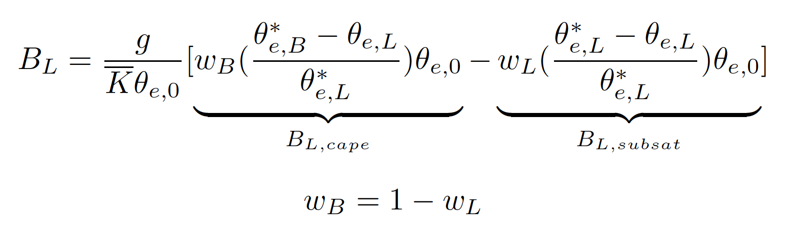

**MCS Precipitation and Buoyancy Diagnostic** This POD provides diagnostics for tropical mesoscale convective systems (MCSs) and their thermodynamic environments, utilizing an empirical buoyancy measure ($B_L$). Specifically, these diagnostics are designed to evaluate model performance in representing the fundamental spatial-temporal characteristics of tropical MCSs, as well as the associated precipitation responses to buoyancy under both MCS and non-MCS conditions.

**Notes for Interpretation**

- **MCS Frequency & MCS Precipitation Contribution**

   .. image:: ./precipitation_MCScontribution.png
      :width: 850px
      :height: 250px
      :alt: MCS Precipitation Contribution

   The default "snapshot-based" MCS definition identifies a rainy, cold cloud system with an area greater than 40,000 km². Consequently, the resulting statistics primarily reflect MCS characteristics during their mature stage. This definition may explain the relatively lower contribution of MCSs to total precipitation seen in the observational reference compared to values commonly reported in the literature. 

- **2-D Joint Histogram and Conditionally-Averaged Precipitation**

   .. image:: ./BLprecip_capesubsat_merged_2005-2014.ocean.png
      :width: 850px
      :height: 250px
      :alt: 2-D Joint Histogram of Buoyancy and Precipitation

   These plots illustrate precipitation sensitivity to $B_{L,cape}$ and $B_{L,subsat}$ for conditions classified as MCS, non-MCS deep convection, and other regimes. For example, models often exhibit enhanced conditionally-averaged precipitation when $B_{L,subsat} \approx 0$, while showing comparatively weak sensitivity to $B_{L,cape}$. This behavior suggests that, in models, precipitation is triggered primarily in a near-saturated lower-free troposphere, implying that convection parameterization schemes (when active) may play a reduced role compared to what is inferred from observations. 

   Two distinct regimes are highlighted in the figures: 
   1. **The highly buoyant regime** (indicated by the triangle), which typically exhibits a sharp enhancement of precipitation as $B_L$ increases.
   2. **The low-$B_{L,cape}$, near-saturated regime** (indicated by the rectangle), which is more commonly associated with stratiform precipitation.

---

**Required Variables (settings.jsonc)**

- **3-D Variables:** Air temperature (`ta`), specific humidity (`hus`)
- **2-D Variables:** Precipitation flux (`pr`), TOA outgoing longwave radiation (`rlut`) 
- **Data Structure:** 3-D variables require (`time`, `plev`, `lat`, `lon`); 2-D variables require (`time`, `lat`, `lon`).

+----------------------------+------------------------------------------------------+
| Required Variables         | Data Frequency                                       |
+============================+======================================================+
| **MCS Identification:** | Snapshots or short averages ($\le$ 6 hr);            |
| `pr`, `rlut`               | not strictly dependent on sampling frequency.        |
+----------------------------+------------------------------------------------------+
| **Lower-Tropospheric       | Corresponding times at which MCSs                    |
| Buoyancy:** `ta`, `hus`    | are identified.                                      |
+----------------------------+------------------------------------------------------+

**Minimum Data Requirements**

- **Length:** At least one year of $\le$ 6-hourly data to ensure sufficient sampling of tropical MCSs. (Note: The observational reference is based on 10 years of data).
- **Resolution:** Higher horizontal resolution ($\le$ 0.5°) is recommended for optimal tracking. 

**Output Data Information** - **High-Frequency Outputs:** The estimated data size for high-frequency outputs (e.g., 1-year, 3-hourly, ~0.5° resolution) is approximately 8 GB per model year. 
- **Condensed Statistics:** The condensed statistical output (monthly, regridded data) requires about 100 MB per model year. 
- Users may choose to retain the high-frequency outputs or keep only the condensed statistics to save storage space. 

---

**Optional Settings for Diagnostics (settings.jsonc)**

- **Regridding Resolution (`regrid_res`):** Regrids model statistics from the native grid space to 0.5° or 1° (default = 1). Set to `"None"` to skip regridding. Conservative regridding is applied by default to ensure consistent comparisons between model outputs and the observational reference (GPM-IMERG + ERA5 at 0.25°/0.5°/1°). 
- **MCS Identifier Parameters:** Customize thresholds for the default identifier, including minimum cloud size (`minsize_MCS`), minimum precipitation feature size (`minsize_PF`), and temperature thresholds (`min_TbCold`, `min_TbCore`).
- **Alternative MCS Input Data (`run_mcs_off`):** External MCS tracking data (e.g., from PyFLEXTRKR) is supported via standardized input directories and variables. See the "Pipeline of Diagnostic Processes" section below for details.

---

**Pipeline of Diagnostic Processes**

The POD executes the following steps in order:

1. **`run_MCS_identifier`** Identifies MCSs. *Note for external data users:* If you have your own 2-D MCS masks, create a directory named `MCS_identifier` under the MDTF default work path:  
   `mdtf/wkdir/MDTF_output/MCS_precip_buoy_stats/model/netCDF/MCS_identifiers`  
   Organize the data chronologically by year (e.g., folders named `2005`, `2006`). Each year’s folder should contain the corresponding high-frequency 2-D MCS mask files (e.g., `cloudid_PyFLEXTRKR_mcs_20071231.0000.nc`). 
2. **`run_precip_statistics`**
   Calculates precipitation-associated statistics and generates condensed statistical netCDF files.
3. **`run_buoyancy_calculation`**
   Calculates the lower-tropospheric buoyancy measure ($B_L$).
4. **`run_buoyancy_statistics`**
   Calculates the 2-D joint histograms of buoyancy components and conditionally-averaged precipitation, generating the corresponding condensed statistical netCDF files.
5. **`plot_precip_statistics`**
   Generates map plots of MCS frequency and MCS-associated precipitation. 
6. **`plot_buoyancy_precip_statistics`**
   Generates plots of joint histograms and conditionally-averaged precipitation for grid points categorized as MCS, non-MCS deep convection, and other.

---

**Methodology** Following Ahmed and Neelin (2021), an **empirical buoyancy measure** ($B_L$) is calculated to represent the MCS-associated thermodynamic environment within this POD. Unlike traditional parcel-based buoyancy, the $B_L$ measure incorporates the vertical thermodynamic structure and deep-inflow, mass-flux-driven entrainment processes in the lower troposphere. 

- **$B_{L,cape}$**: Represents undilute CAPE-like instability, indicating the buoyancy of a parcel as it rises without entrainment.
- **$B_{L,subsat}$**: Represents the dilution of parcel buoyancy due to entrainment effects from the lower free troposphere, expressed as a function of subsaturation.

Tropical MCSs are identified using outgoing longwave radiative flux and precipitation, following definitions similar to those used in PyFLEXTRKR. The POD's default MCS identification is "snapshot-based." However, users can implement their own pre-calculated MCS 2-D mask datasets to bypass the internal identification step (configured via `settings.jsonc`).

**Definition of an MCS:**

To identify connected cloud objects, we adopt parameters described in PyFLEXTRKR (Feng et al., 2021; 2023). Model outgoing longwave radiation is first converted to brightness temperature ($T_b$) following Ohring et al. (1984). An MCS is defined by meeting all the following criteria:

- **Cold Cloud Size:** $> 40,000$ km² of contiguous cold cloud ($T_b < 241$ K).
- **Precipitation Feature:** $> 1,000$ km² with precipitation $> 0.5$ mm/hr.
- **Core Cloud Existence:** At least one pixel must exhibit a deep convective core ($T_b < 225$ K).

---

**References** - Ahmed, F., & Neelin, J. D. (2021). A process-oriented diagnostic to assess precipitation-thermodynamic relations and application to CMIP6 models. *Geophysical Research Letters*, 48(14).
- Tsai, W.-M., Ahmed, F., Neelin, J. D., Feng, Z., & Leung, L. R. (2026). Buoyancy-Precipitation Coupling in the Life Cycle of Tropical Mesoscale Convective Systems. *Geophysical Research Letters*, under review. (Preprint: https://essopenarchive.org/doi/pdf/10.22541/essoar.175165621.17354518)
